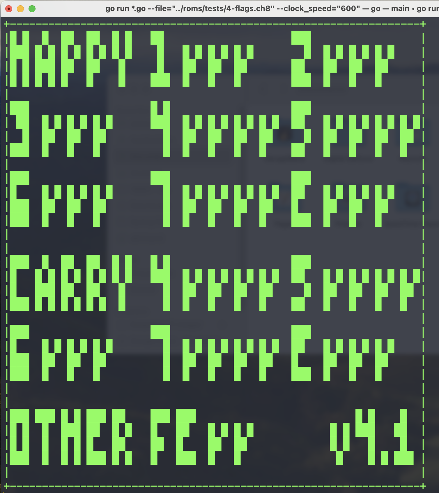
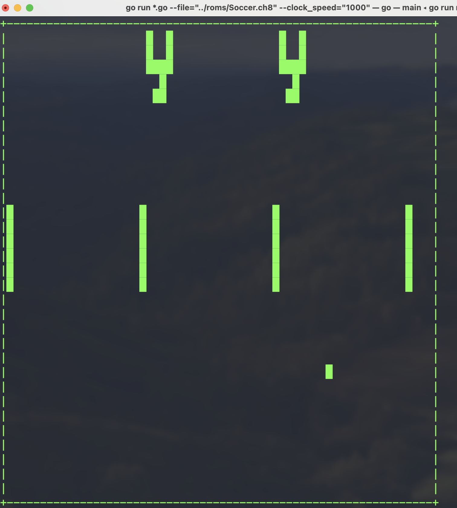

# CHIP-8 Interpreter 

This project is a functional interpreter for the CHIP-8 virtual machine, a simple, 8-bit computer architecture used to run games and programs from the 1970s. 

## Overview

CHIP-8 is a high-level interpreted programming language that was initially created for programming simple games on early microcomputers. It's particularly famous for its simplicity containing only 30 odd instructions to emulate, making it a popular choice for those looking to learn more about interpreters, emulators, and virtual machines.

This project implements a CHIP-8 interpreter in Golang, capable of loading and executing CHIP-8 programs, including games like Pong, Space Invaders, and more retro fun stuff!

## Why write an emulator for an xx decade old "imaginary" VM now?

I decided to write this CHIP-8 interpreter as a quick weekend project to learn about emulation. My primary goal was to understand the foundational concepts behind writing an emulator, particularly how systems interact at a low level — things like memory management, opcode handling, graphics rendering, and input processing.

Once I felt comfortable with the basics of CHIP-8, I moved on to more complex systems, such as the Game Boy (GB). The GB, while more advanced than CHIP-8, shares many core concepts in how it handles memory, registers, and input/output. 

If you're looking to get started with emulation or are curious about how interpreters work, CHIP-8 is an excellent learning experience, and I hope this project helps inspire others to explore this domain!

## Features

- **Full CHIP-8 instruction set support**: Implements all 35 original CHIP-8 instructions.
- **Memory management**: Handles memory space, including fonts, program data, and stack.
- **Timers**: Implements the delay and sound timers that decrement at 60Hz.
- **Graphics**: Simple rendering of the CHIP-8 display (64x32 monochrome) using Unicode characters straight in the terminal.
- **Input handling**: Maps the original 16-key HEX input to standard keyboard shell input.
- **Sound support**: Not supported.

## Running in the Terminal with Unicode Graphics

This CHIP-8 interpreter runs natively in the terminal using Unicode manipulation to simulate the CHIP-8 display. Instead of relying on graphical libraries, the interpreter renders the 64x32-pixel monochrome display directly in the terminal, where each pixel is represented by Unicode characters such as `█` (U+2588) for on-pixels and a space (` `) for off-pixels.

### Terminal Display Example:

> [Flag tests](https://github.com/Timendus/chip8-test-suite) for CHIP-8 

> Soccer game

### How does it work?

Refer to my [Notes](./notes.md) for a quick overview of the system and its different parts.

## Acknowledgements

- [Cowgod's CHIP-8 Technical Reference](http://devernay.free.fr/hacks/chip8/C8TECH10.HTM).
- [Test suite for CHIP-8](https://github.com/Timendus/chip8-test-suite)